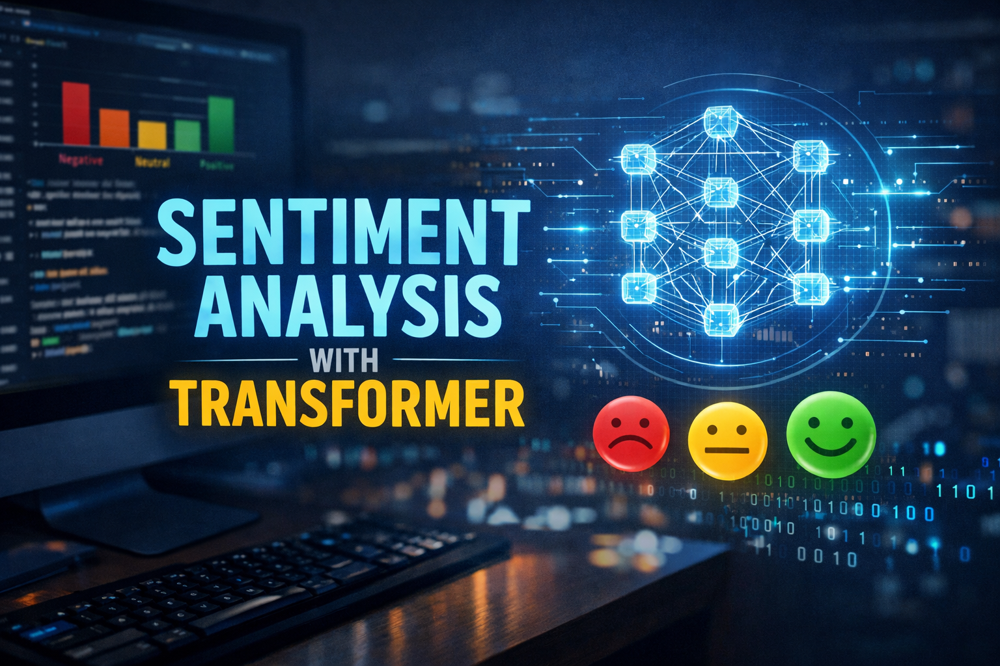

# Projet Transformer - Classification de sentiments

<p align="center">
  
</p>

Implémentation  d'un **Transformer ()Encoder** pour la classification de texte, avec comparaison à des baselines:
- `RNNClassifier` (GRU/LSTM)
- `TextCNNClassifier`
- `TransformerClassifier` (basé sur un encodeur Transformer)

Objectifs principals: comprendre les mathématiques derrière les transformers, implémenter, comparer les performances (qualité/précision et comportement d'entraînement) de plusieurs architectures sur l'analyse de sentiments IMDb.

## Contenu du projet

```text
.
├── src/
│   ├── transformer_modules/
│   │   ├── __init__.py
│   │   └── transformer_modules.py    # blocs Transformer (attention, encoder, embeddings...)
│   └── modeles/
│       ├── __init__.py
│       ├── transformer_classifier.py # tête de classification pour l'encodeur Transformer
│       ├── rnn_classifier.py         # GRU/LSTM
│       └── cnn_classifier.py         # TextCNN
├── analyse_sentiment.ipynb           # pipeline de classification de sentiments
├── ProjetTransformer.ipynb           # notebook principal / expérimentation
├── pyproject.toml
└── uv.lock
```

## Architecture implémentée

Le module `src/transformer_modules/transformer_modules.py` contient notamment:
- scaled dot-product attention
- multi-head attention
- position-wise feed-forward
- residual + layer norm
- positional encoding
- empilement de blocs encodeur
- modèle encodeur complet pour la classification

## Installation (avec uv)

Pré-requis:
- Python `>= 3.13`
- `uv` installé

Créer l'environnement et installer les dépendances:

```bash
uv sync
```

Activer l'environnement:

```bash
source .venv/bin/activate
```

Option alternative (editable install):

```bash
uv pip install -e .
```

## Utilisation

Lancer Jupyter:

```bash
uv run jupyter lab
```

Notebooks principaux:
- `analyse_sentiment.ipynb`
- `ProjetTransformer.ipynb`

Imports recommandés:

```python
from src.transformer_modules.transformer_modules import TransformerEncoderModel
from src.modeles import TransformerClassifier, RNNClassifier, TextCNNClassifier
```

## Dataset IMDb

Le dataset IMDb (ACL) est utilisé pour l'analyse de sentiments.

## Comparaison des modèles

Le protocole de comparaison attendu:
- même prétraitement/tokenisation
- même split train/test
- même métrique principale (ex: accuracy, F1, ROC-AUC)
- comparaison:
  - Transformer Encoder + classifier
  - GRU/LSTM classifier
  - CNN classifier
